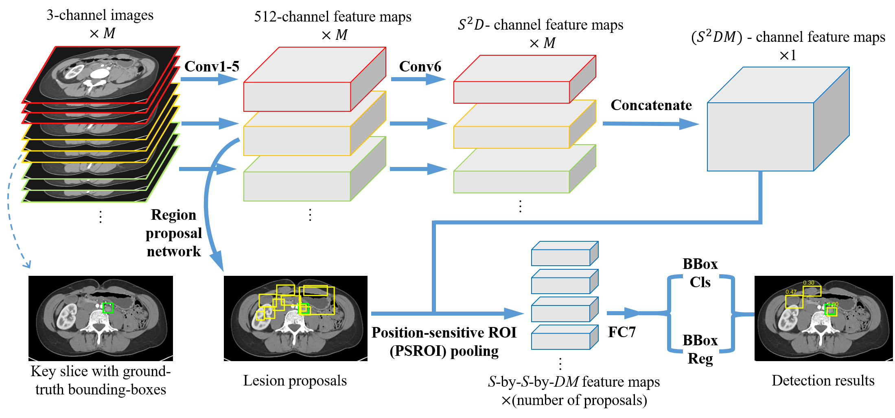
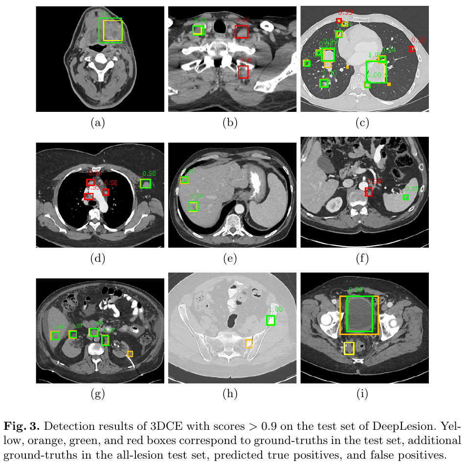

# Instruction By Chuck
## Quick Start
1. Create log directory
```sh
mkdir log
```
2. Download vggnet pretrained model
```sh
mkdir model
cd model
# Download vgg16-0000.params into model/
wget http://data.mxnet.io/models/imagenet/vgg/vgg16-0000.params
cd ..
```
3. Put dataset into the right place
```sh
mkdir -p data/Images_png
# Unzip 8G dataset and put them into Images_png
```
4. Build necessary libs
```sh
# cd to root of project and then build
make
```
5. Set up python environment

**Python 2.7**
```sh
pip install mxnet
pip install pyyml
pip install matplotlib
# After installing mxnet, numpy1.14 would be installed, need to change to numpy1.16
pip install numpy==1.16
```

## Configurations
### `default.yml`
* [Line 7] `begin_epoch: 0`: Control start epoch, should be set to the best model number(Check model/ to find out. You'll see something like 3DCE1image3slice-`xxxx`.params) when test.
* [line 17] `e2e_epoch: 5`: Epochs for training.
* [line 26] `val_max_box`: How many boxes will be kept

### `rcnn/config.py`
* [line 138] `default.val_vis = True`: Show detections or not

## Train
```
./train.sh
```

## Test
```
./test.sh
```

## 3D Context Enhanced Region-based Convolutional Neural Network (3DCE)

Developed by Ke Yan (ke.yan@nih.gov, [yanke23.com](http://yanke23.com)), Imaging Biomarkers and Computer-Aided Diagnosis Laboratory, National Institutes of Health Clinical Center

3DCE [1] is an object detection framework which makes use of the 3D context in volumetric image data (and maybe video data) efficiently.

It was primarily designed for lesion detection in 3D CT images. However, the project also contains 2D Faster RCNN and R-FCN, which can be used for other object detection tasks.

Adapted from the code in [https://github.com/sxjscience/mx-rcnn-1](https://github.com/sxjscience/mx-rcnn-1)

## Introduction
* Implemented frameworks: Faster RCNN, R-FCN, Improved R-FCN [1], 3DCE R-FCN (see rcnn/symbol/symbol_vgg.py and tools/train.py)
* For the **DeepLesion** dataset [2,3,4], we:
    * Load data split and annotations from DL_info.csv (see dataset/DeepLesion.py)
    * Load images from 16-bit png files (see fio/load_ct_img.py)
* To preprocess the CT images, we: (see fio/load_ct_img.py)
	* Linearly interpolate intermediate slices according to the slice interval
    * Do intensity windowing
    * Normalize pixel spacing
    * Clip the black borders
* Other useful features:
    * We evaluate on the validation set after each epoch. After several epochs, we evaluate the test set using the best model (see tools/train.py, validate.py, test.py, and core/tester.py)
    * Adjustable batch size (num of images per batch) and iter_size (accumulate gradients in multiple iterations)
    * Previous snapshots can be resumed by simply setting "exp_name" and "begin_epoch" in default.yml
    * When running train.sh, it will generate log files named with "exp_name"
    * Images can be prefetched from hard disk to speed up

##

#### Requirements
* MXNet 1.0.0
* Python 2.7
* Before running, run "make" to compile binary files
* To train the universal lesion detector, download the DeepLesion dataset [2]

#### File structure
* experiment_logs: log files for the results in our paper [1].
* images: images used in this readme.
* rcnn: the core codes. The main function is in core/tools/train.py.
* config.yml and default.yml: configuration files to run the code.
* train.sh and test.sh: run these files to train or test.

#### Notes
* To change dataset, implement your own data code according to DeepLesion.py and pascal_voc.py, and maybe change the data layer in core/loader.py.
* Only end-to-end training is considered in this project.

#### References
1. K. Yan, M. Bagheri, and R. M. Summers, “3D Context Enhanced Region-based Convolutional Neural Network for End-to-End Lesion Detection,” in MICCAI, 2018 ([arXiv](https://arxiv.org/abs/1806.09648))
1. The DeepLesion dataset. ([download](https://nihcc.box.com/v/DeepLesion))
1. K. Yan, X. Wang, L. Lu, and R. M. Summers, “DeepLesion: Automated Mining of Large-Scale Lesion Annotations and Universal Lesion Detection with Deep Learning,” J. Med. Imaging, 2018. ([paper](http://yanke23.com/papers/18_JMI_DeepLesion.pdf))
1. K. Yan et al., “Deep Lesion Graphs in the Wild: Relationship Learning and Organization of Significant Radiology Image Findings in a Diverse Large-scale Lesion Database,” in CVPR, 2018. ([arXiv](https://arxiv.org/abs/1711.10535))



